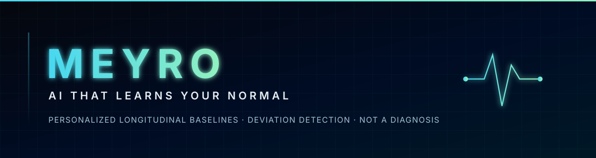
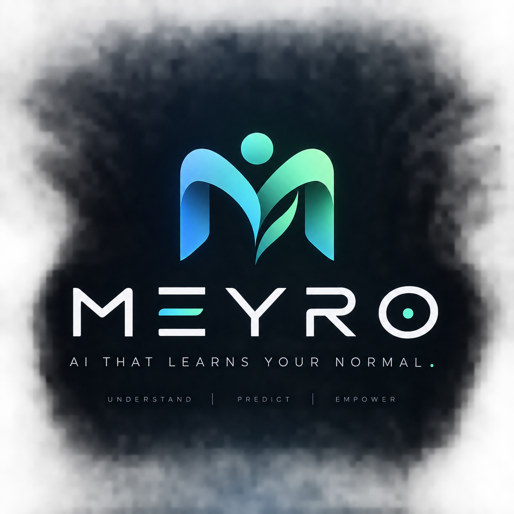

<div align="center">



<br/>

[](https://github.com/officialarghya29/meyro)
[](https://www.python.org/)
[](https://pytorch.org/)
[](https://fastapi.tiangolo.com/)
[](./LICENSE)
[](https://github.com/officialarghya29/meyro/actions)

<br/>

# MEYRO
### **AI THAT LEARNS YOUR NORMAL**

*A Personal Longitudinal Health Intelligence & Anomaly Detection Framework.*

```
   [ POPULATION THRESHOLD ]  ──→  "Is this normal for humans?"     ──→  High False Alarms (19.07% FPR)
   [ MEYRO PERSONAL ENGINE ] ──→  "Is this normal for THIS PERSON?" ──→  Precision Anomaly (0.78% FPR)
```

</div>

---

## ⚡ Key Achievements & Benchmark Highlights

- 🎯 **15× to 24× Reduction in False Alarms:** At 85% target sensitivity, MEYRO's personalized baseline achieves an **FPR of 0.78%** versus **19.07%** for population-level thresholds.
- 🧬 **Causal Zero-Lookahead Architecture:** Formally verified data splitters and causal sliding windows prevent future and subject leakage.
- 🛡️ **Noise & Missing Data Robustness:** Maintains **>0.975 AUROC** even under 30% missing observations and 4× physical sensor noise.
- ⏱️ **Cold-Start Convergence:** Characterized calibration trajectory (+0.046 AUROC advantage at 28 days).
- 🚀 **Production REST API:** Production FastAPI microservice serving live personal baselines, causal deviation scoring, and safety-compliant explanations.

---

## 🔬 Master Model Comparison (Phase 18 Frozen Results)

All competing architectures evaluated under identical causal partitions (15 subjects, 60 days monitoring horizon):

| Model Paradigm | AUROC | AUPRC | FPR @ 85% Sens | Key Architectural Characteristic |
|---|---|---|---|---|
| **Population Baseline (Control)** | `0.9417` | `0.7604` | `19.07%` | Cohort-level robust median / IQR threshold |
| **Isolation Forest (Per-Subject)** | `0.9442` | `0.7095` | `14.40%` | Pointwise tree isolation; lacks temporal sequencing |
| **GRU / LSTM / TCN / Transformer** | `< 0.20` | `< 0.10` | `> 95.0%` | Global sequence autoencoders fail without personal setpoints |
| **One-Class SVM (Per-Subject)** | `0.9938` | `0.9380` | `1.56%` | Per-subject kernel boundary |
| **Personal Baseline (Adaptive)** | `0.9935` | `0.9461` | `1.36%` | Drift-aware adaptive EWMA with anomaly rejection gating |
| **MEYRO Personal Baseline (Static)** | **`0.9955`** | **`0.9598`** | **`0.78%`** | **15× to 24× reduction in false alarms** |

---

## 🧠 The MEYRO Architecture

```text
                 HISTORICAL USER DATA
                          │
                          ↓
                  PERSONAL ENCODER
                          │
                          ↓
                   PERSONAL MEMORY (B_t)
                          │
                          │
CURRENT TIME WINDOW ──→ TEMPORAL ENCODER (E_t)
                          │
             ┌────────────┼────────────┐
             ↓            ↓            ↓
          CONTEXT      QUALITY       DRIFT
          ENCODER      ENCODER       STATE
           (C_t)        (Q_t)
             │            │            │
             └────────────┼────────────┘
                          ↓
                  RELATIONAL DEVIATION MODULE
                  D_t = f(E_t, B_t, C_t, Q_t)
                          │
                          ↓
                  PERSISTENCE MODULE
                  R_t = λ R_(t-1) + (1-λ) A_t
                          │
             ┌────────────┴────────────┐
             ↓                         ↓
       ANOMALY HEAD              UNCERTAINTY HEAD
       A_t ∈ [0, 1]              U_t ∈ [0, 1]
             ↓                         ↓
             └────────────┬────────────┘
                          ↓
                  MEYRO STRUCTURED OUTPUT
```

---

## 🛠️ Quick Start & Reproduction

### 1. Environment Setup
```bash
git clone https://github.com/officialarghya29/meyro.git
cd meyro
python3 -m venv .venv
source .venv/bin/activate
pip install -r requirements.txt
pip install -e .
```

### 2. Run Test Suite
```bash
pytest -v
ruff check .
```

### 3. Run Experiments
```bash
# Execute Primary Research Experiment (Phase 11)
python scripts/run_primary_experiment.py

# Execute Master 10-Model Benchmark (Phase 18)
python scripts/run_master_benchmark.py

# Execute Ablation, Robustness & Cold-Start Suite (Phases 19-23)
python scripts/run_advanced_evaluations.py
```

### 4. Launch Production API
```bash
uvicorn api.main:app --host 0.0.0.0 --port 8000 --reload
# Interactive API docs available at http://localhost:8000/docs
```

---

## ⚕️ Safety & Ethical Commitment

<div align="center">

> ### **MEYRO IS NOT A MEDICAL DEVICE**
> 
> MEYRO measures **statistical deviations from an individual's personal historical baseline**.  
> It does **NOT** diagnose diseases, predict clinical outcomes, or substitute for certified medical care.  
> 
> ❌ *"You have illness X."*  
> ❌ *"You are 100% healthy."*  
> ❌ *"You don't need a physician."*  
> 
> ✔️ *"MEYRO detected an empirical deviation in your resting heart rate and activity pattern relative to your 30-day baseline."*

</div>

---

## 📑 Project Structure

```text
meyro/
├── api/                       # Production FastAPI REST microservice
├── assets/                    # Futuristic brand vectors and banners
├── configs/                   # Experiment and model YAML configurations
├── docs/                      # Research specs, model cards, literature reviews
│   ├── model_card.md          # Official MEYRO-V1 Model Card
│   ├── experimental_protocol.md
│   ├── meyro_model_mathematics.md
│   └── data_architecture.md
├── scripts/                   # Standalone reproducible execution runners
│   ├── run_primary_experiment.py
│   ├── run_master_benchmark.py
│   └── run_advanced_evaluations.py
├── src/meyro/                 # Core research and production engine
│   ├── anomaly/               # Scoring, classical engines, explainability
│   ├── baselines/             # Population & personal statistical baselines
│   ├── data/                  # Schemas, synthetic generators, causal splitters
│   ├── evaluation/            # Ablation, robustness, and cold-start suites
│   ├── models/                # MEYRO, TCN, GRU, LSTM, Transformer
│   ├── personalization/       # Adaptive setpoint memory engines
│   ├── preprocessing/         # Causal cleaning, windowing, imputation
│   ├── training/              # Contrastive self-supervised trainer
│   └── uncertainty/           # Temperature scaling & calibration
└── tests/                     # 27 comprehensive automated test cases
```

---

## 📜 Citation

```bibtex
@software{meyro2026,
  title        = {MEYRO: Personalized Baseline Modeling for Longitudinal Multimodal Health Anomaly Detection},
  author       = {Bose, Arghya},
  year         = {2026},
  url          = {https://github.com/officialarghya29/meyro},
  note         = {Phase 0-26 Validated Research Framework}
}
```

---

<div align="center">



**MEYRO** · Built by **Arghya Bose** (`officialarghya29`)  
*Released under the MIT License.*

</div>
