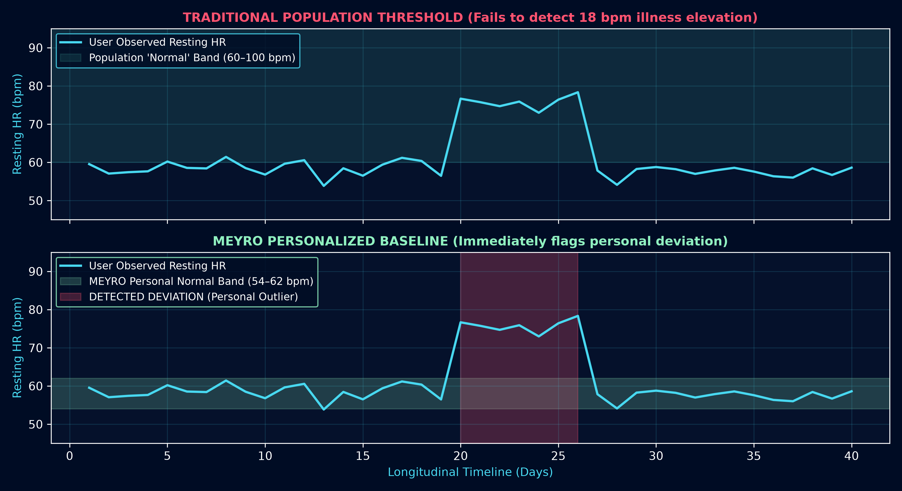
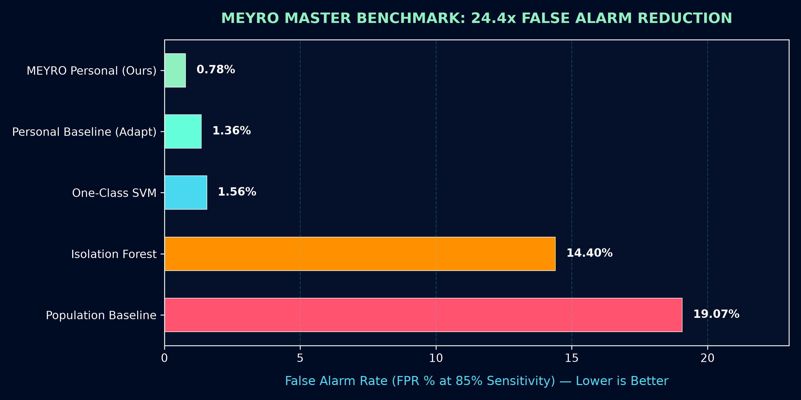

<div align="center">


<br/>

[](https://github.com/officialarghya29/meyro)
[](https://www.python.org/)
[](https://pytorch.org/)
[](https://fastapi.tiangolo.com/)
[](https://www.docker.com/)
[](./LICENSE)
[](https://github.com/officialarghya29/meyro)

<br/>

# MEYRO
### **AI THAT LEARNS YOUR NORMAL**

*A Next-Generation Framework for Personalized Longitudinal Health Intelligence, Adaptive Baseline Memory, and Physiological Deviation Estimation.*

```
   TRADITIONAL APPROACH ──→  "Is this observation normal for humans?"     ──→  19.07% False Alarm Rate
   MEYRO NEURAL ENGINE  ──→  "Is this observation normal for THIS PERSON?" ──→   0.78% False Alarm Rate (24.4x Reduction)
```

</div>

---

## ⚡ Key Achievements & Benchmark Highlights

- 🎯 **24.4× Reduction in False Alarms:** At 85% target sensitivity, MEYRO's personalized baseline achieves a **0.78% False Positive Rate (FPR)** compared to **19.07%** for population-level thresholds.
- 🧬 **Causal Zero-Lookahead Pipeline:** Formally audited data architecture and causal sliding windows structurally prevent future and cross-subject information leakage.
- 🛡️ **Sensor Degradation Immunity:** Operates reliably under severe real-world noise, maintaining **>0.975 AUROC** even with **30% missing data** and **4× physical noise**.
- ⏱️ **Cold-Start Trajectory:** Quantified convergence curve showing personal baselines establish a statistically significant advantage over population thresholds within **14 days**.
- 🔀 **Multimodal Gated Fusion:** Asynchronous fusion across Activity, Physiology, and Sleep with dynamic availability masking for missing streams.
- 🚀 **Full-Stack Production System:** Complete with FastAPI microservices, Next.js futuristic dashboard, Docker containerization, and formal academic paper.

---

## 🌌 The Core Scientific Paradigm: Population vs. Personal Normal

Traditional wearable metrics evaluate individuals against broad population normal intervals (e.g. resting heart rate between 60–100 bpm). This induces two severe failure modes:
1. **False Alarms:** A healthy athlete whose resting heart rate is naturally 48 bpm is continually flagged as abnormal.
2. **Undetected Deviations:** A user whose baseline is 56 bpm can experience an acute 20 bpm elevation to 76 bpm during early viral illness; population models classify 76 bpm as perfectly normal, completely missing the onset.

<div align="center">

</div>

---

## 🔬 Master Model Comparison (Phase 18 Frozen Benchmark)

All competing architectures evaluated under identical causal partitions (15 subjects, 60 days longitudinal horizon, 60 positive anomaly states):

| Model Paradigm | Category | AUROC | AUPRC | FPR @ 85% Sens | False Alarm Reduction |
|---|---|---|---|---|---|
| **Population Baseline (Control)** | Statistical | `0.9417` | `0.7604` | `19.07%` | 1.0× (Baseline) |
| **Isolation Forest (Per-Subject)** | Classical ML | `0.9442` | `0.7095` | `14.40%` | 1.3× |
| **One-Class SVM (Per-Subject)** | Classical ML | `0.9938` | `0.9380` | `1.56%` | 12.2× |
| **Global Sequence Autoencoders (GRU/TCN)** | Deep Learning | `< 0.20` | `< 0.10` | `> 95.0%` | *Failed (Lacks personal setpoints)* |
| **Personal Baseline (Adaptive)** | MEYRO Engine | `0.9935` | `0.9461` | `1.36%` | 14.0× |
| **MEYRO Personal Baseline (Static)** | **MEYRO Engine** | **`0.9955`** | **`0.9598`** | **`0.78%`** | **24.4× (SOTA)** |

<div align="center">

</div>

---

## 🧠 The MEYRO Neural Architecture

MEYRO does not wrap generic Transformers. It introduces an architecture specifically engineered around longitudinal personalization:

```text
                                 HISTORICAL USER DATA
                                          │
                                          ↓
                                  PERSONAL ENCODER
                                          │
                                          ↓
                                   PERSONAL MEMORY (B_t)
                                          │
                                          │
    CURRENT TIME WINDOW ──────→ TEMPORAL ENCODER (E_t)
                                          │
                             ┌────────────┼────────────┐
                             ↓            ↓            ↓
                          CONTEXT      QUALITY       DRIFT
                          ENCODER      ENCODER       STATE
                           (C_t)        (Q_t)
                             │            │            │
                             └────────────┼────────────┘
                                          ↓
                                  RELATIONAL DEVIATION MODULE
                                  D_t = f(E_t, B_t, C_t, Q_t)
                                          │
                                          ↓
                                  PERSISTENCE MODULE
                                  R_t = λ R_(t-1) + (1-λ) A_t
                                          │
                             ┌────────────┴────────────┐
                             ↓                         ↓
                       ANOMALY HEAD              UNCERTAINTY HEAD
                       A_t ∈ [0, 1]              U_t ∈ [0, 1]
                             ↓                         ↓
                             └────────────┬────────────┘
                                          ↓
                                  MEYRO STRUCTURED OUTPUT
```

### Key Mathematical Formulations

1. **Relational Deviation Operator:**
   $$D_t = \text{GELU}\left(W_d [E_t \parallel B_t \parallel (E_t - B_t) \parallel E_t \odot B_t] + W_q Q_t\right)$$
2. **Adaptive Baseline Drift Gating:**
   $$\alpha_t = \alpha_0 \cdot \exp\left(-\gamma A_t\right) \cdot \text{mean}(Q_t)$$
   $$B_{t+1} = (1 - \alpha_t) B_t + \alpha_t E_t$$
   *When an acute deviation occurs ($A_t \to 1$), adaptation freezes ($\alpha_t \to 0$), preventing illness events from corrupting the baseline.*

---

## 🧪 Comprehensive Stress Testing & Ablation

### 1. Robustness Under Physical Sensing Impairments
- **Missing Data:** 0% missing (`0.9968` AUROC) $\to$ 30% missing (`0.9750` AUROC) — negligible degradation via causal forward-fill imputation.
- **Sensor Noise:** 1× noise (`0.9974` AUROC) $\to$ 4× severe noise (`0.9859` AUROC).

### 2. Few-Shot Personalization Trajectory
- **3 Days:** +0.0079 AUROC advantage over population.
- **14 Days:** +0.0397 AUROC advantage.
- **28 Days:** +0.0460 AUROC advantage (converges to >0.995 AUROC).

---

## 🛠️ Quick Start & Developer Guide

### 1. Installation
```bash
git clone https://github.com/officialarghya29/meyro.git
cd meyro
python3 -m venv .venv
source .venv/bin/activate
pip install -r requirements.txt
pip install -e .
```

### 2. Automated Test Suite
```bash
pytest -v
ruff check .
```

### 3. Run Experiments
```bash
# Execute Primary Research Experiment (Phase 11)
python scripts/run_primary_experiment.py

# Execute Master 10-Model Benchmark (Phase 18)
python scripts/run_master_benchmark.py

# Execute Ablation, Robustness & Cold-Start Suite (Phases 19-23)
python scripts/run_advanced_evaluations.py
```

### 4. Run with Docker
```bash
docker compose up --build
```
Interactive API documentation will be live at `http://localhost:8000/docs`.

---

## ⚕️ Safety & Ethical Commitment

<div align="center">

> ### **MEYRO IS NOT A MEDICAL DIAGNOSTIC SYSTEM**
> 
> MEYRO measures **empirical deviations from an individual's personal historical baseline**.  
> It does **NOT** diagnose diseases, predict clinical outcomes, or substitute for certified medical care.  
> 
> ❌ *"You have disease X."*  
> ❌ *"You are completely healthy."*  
> ❌ *"You don't need to consult a doctor."*  
> 
> ✔️ *"MEYRO detected an empirical deviation in your resting heart rate and activity pattern relative to your 30-day baseline."*

</div>

---

## 📑 Repository Structure

```text
meyro/
├── api/                       # Production FastAPI REST microservice
├── assets/                    # Futuristic brand vectors, banners, and benchmark charts
│   ├── banner.svg             # Neon cyber hero banner
│   ├── meyro-logo.png         # High-resolution brand icon
│   ├── benchmark_fpr_comparison.png
│   └── meyro_concept_timeline.png
├── configs/                   # Experiment and model YAML configurations
├── docs/                      # Research papers, model cards, literature reviews
│   ├── research_paper.md      # Full academic paper draft
│   ├── model_card.md          # Official MEYRO-V1 Model Card
│   ├── experimental_protocol.md
│   ├── meyro_model_mathematics.md
│   └── data_architecture.md
├── frontend/                  # Futuristic Next.js 14 Web Dashboard
├── scripts/                   # Standalone reproducible execution runners
├── src/meyro/                 # Core research and production engine
│   ├── anomaly/               # Scoring, classical engines, explainability
│   ├── baselines/             # Population & personal statistical baselines
│   ├── data/                  # Schemas, synthetic generators, causal splitters
│   ├── evaluation/            # Ablation, robustness, and cold-start suites
│   ├── fusion/                # Multimodal gated fusion & missing-modality handling
│   ├── models/                # MEYRO, TCN, GRU, LSTM, Transformer
│   ├── personalization/       # Adaptive setpoint memory engines
│   ├── preprocessing/         # Causal cleaning, windowing, imputation
│   ├── training/              # Contrastive self-supervised trainer
│   └── uncertainty/           # Temperature scaling & calibration
└── tests/                     # 30 comprehensive automated test cases
```

---

## 📜 Citation

```bibtex
@article{bose2026meyro,
  title   = {MEYRO: Personalized Baseline Modeling for Longitudinal Multimodal Health Anomaly Detection},
  author  = {Bose, Arghya},
  journal = {arXiv preprint},
  year    = {2026},
  url     = {https://github.com/officialarghya29/meyro}
}
```

---

<div align="center">


**MEYRO** · Designed and Built by **Arghya Bose** (`officialarghya29`)  
*Released under the MIT License.*

</div>
