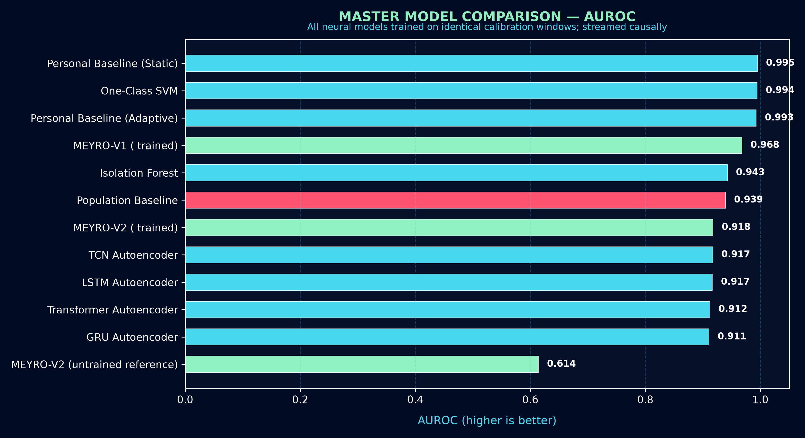
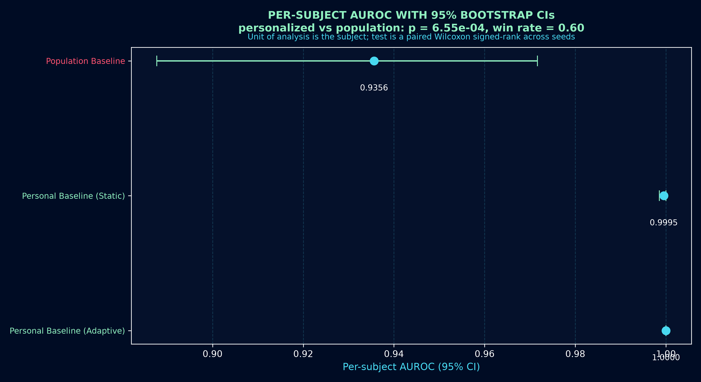
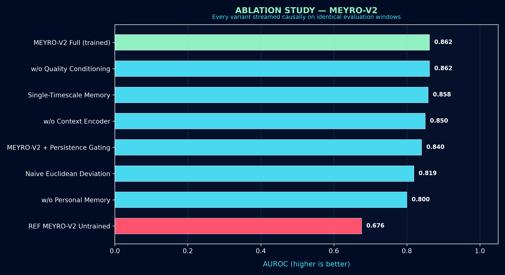
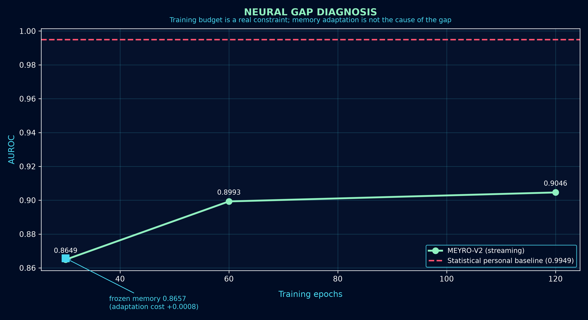
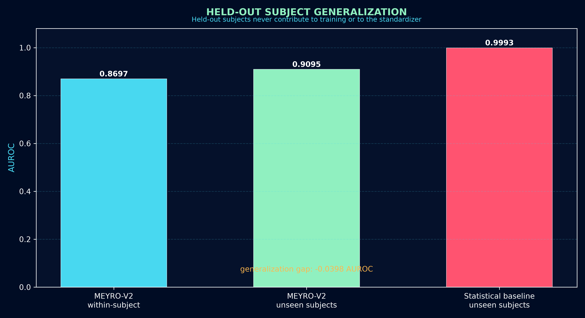
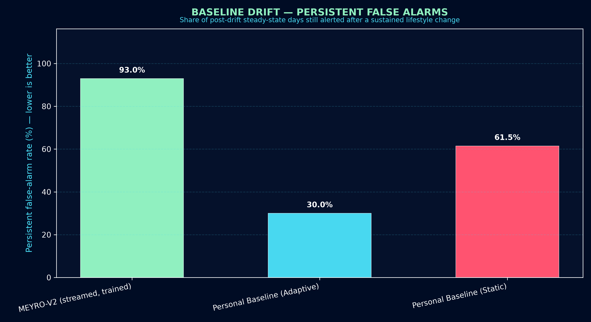
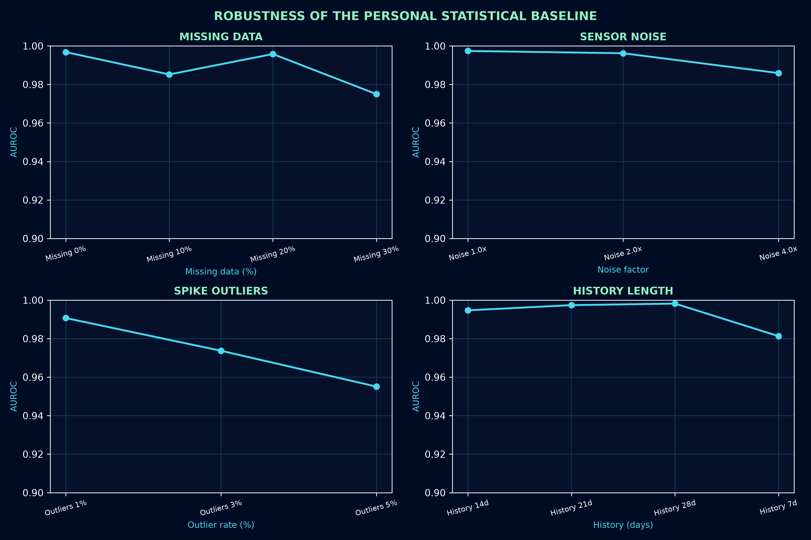
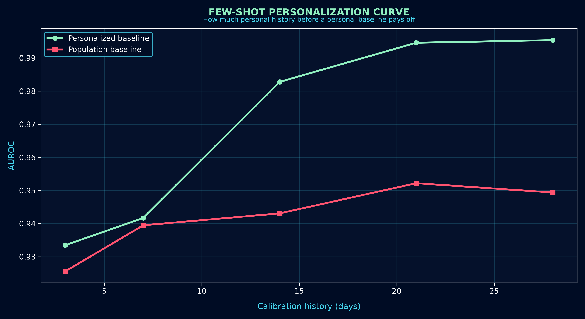

<div align="center">


<br/>

[](https://github.com/officialarghya29/meyro)
[](https://www.python.org/)
[](https://pytorch.org/)
[](https://github.com/officialarghya29/meyro)
[](./LICENSE)

<br/>

# MEYRO
### **AI THAT LEARNS YOUR NORMAL**

*A research prototype for personalized longitudinal baselines and deviation estimation on wearable signals.*

```
   POPULATION BASELINE  ──→  "Is this normal for humans?"      ──→  19.34% false alarms
   PERSONAL BASELINE    ──→  "Is this normal for THIS person?" ──→   0.94% false alarms
```

</div>

---

## ⚡ Key Findings

Every number on this page is read from `experiments/*/results.json`, which the code writes during a run. Figures are generated from those same files. Nothing is typed by hand.

<table>
<tr><td width="50%" valign="top">

**🎯 Personalization is the dominant effect**

At matched 85% sensitivity, the population baseline fires on **19.34%** of normal windows; the personalized baseline on **0.94%** — a **~20.6×** reduction. Pooled AUROC `0.9394` → `0.9949`.

</td><td width="50%" valign="top">

**📊 It is statistically significant, per person**

Across 3 seeds and 25 subject-seeds, per-subject AUROC goes from **0.9356** `[0.8877, 0.9716]` to **0.9995** `[0.9985, 1.0000]`; paired Wilcoxon **p = 6.6×10⁻⁴**, and personalization **never wins fewer** subjects than it loses.

</td></tr>
<tr><td width="50%" valign="top">

**🛡️ Robust to degraded sensing**

Holds **≥0.975 AUROC** under 30% missing data, 4× sensor noise, 5% spike outliers, 1/3 sampling rate, and 15% per-device bias.

</td><td width="50%" valign="top">

**⏱️ ~14 days before personalization pays**

The advantage is negligible at 3–7 days and becomes material at **14 days** (+0.0397 AUROC), reaching +0.0460 at 28 days.

</td></tr>
<tr><td width="50%" valign="top">

**🌊 MEYRO-V2 fails the drift test — reported, not hidden**

After a sustained lifestyle change, MEYRO-V2 keeps alerting on **93.0%** of steady-state days, *worse* than static (**61.5%**) and adaptive (**30.0%**) statistical baselines. See [below](#-baseline-drift-a-documented-failure).

</td><td width="50%" valign="top">

**⚠️ The learned model does not beat the statistical control**

MEYRO-V1 reaches `0.9680`, MEYRO-V2 `0.9179`, versus `0.9949` for a robust statistical personal baseline. Diagnosis below: this is **not** under-training and **not** adaptation — see [diagnosis](#-diagnosing-the-neural-gap).

</td></tr>
</table>

---

## 🌌 The Core Scientific Paradigm: Population vs. Personal Normal

Population reference intervals (e.g. resting heart rate 60–100 bpm) create two failure modes at once:

1. **False alarms** — a healthy person whose normal is 48 bpm is flagged continuously.
2. **Missed deviations** — a person whose normal is 56 bpm rising to 76 bpm stays "inside normal" while their personal signal changed by 20 bpm.

<div align="center">

</div>

---

## 🧪 Protocol

| Element | Setting |
|---|---|
| Data | `SyntheticBenchmarkGenerator` (seeded), 15 subjects × 60 days |
| Split | 21-day calibration per subject, then causal evaluation |
| Windows | 7-day backward-looking windows; 495 evaluation windows, 14.34% prevalence |
| Normalization | Population z-score fitted on **calibration windows only** |
| Training | All neural models trained on the calibration windows the statistical baselines are fitted on |
| Operating point | Precision/recall/F1/FPR reported at the threshold reaching **85% sensitivity** |
| Determinism | Single-threaded torch, seeded before every model construction |

Subject isolation, backward-only windows, calibration-only normalization and no test-set tuning are asserted by the test suite (`tests/test_leakage_and_invariants.py`).

---

## 🔬 Master Model Comparison

All models see identical causal windows. Threshold-dependent columns are measured at equal recall, so no model is flattered by its own threshold.

| Model | Family | AUROC | AUPRC | F1 | FPR @ 85% Sens |
|---|---|---|---|---|---|
| **Personal Baseline (Static)** | Statistical | **`0.9949`** | **`0.9658`** | **`0.8971`** | **`0.0094`** |
| One-Class SVM (per subject) | Classical ML | `0.9944` | `0.9536` | `0.8905` | `0.0118` |
| Personal Baseline (Adaptive) | Statistical | `0.9929` | `0.9534` | `0.8857` | `0.0165` |
| MEYRO-V1 (trained, streamed) | Neural | `0.9680` | `0.8169` | `0.7722` | `0.0613` |
| Isolation Forest (per subject) | Classical ML | `0.9426` | `0.7349` | `0.6321` | `0.1439` |
| Population Baseline (control) | Statistical | `0.9394` | `0.7792` | `0.5701` | `0.1934` |
| MEYRO-V2 (trained, streamed) | Neural | `0.9179` | `0.6483` | `0.6778` | `0.1132` |
| TCN Autoencoder (trained) | Neural | `0.9172` | `0.5561` | `0.6354` | `0.1415` |
| LSTM Autoencoder (trained) | Neural | `0.9166` | `0.5281` | `0.6813` | `0.1156` |
| Transformer Autoencoder (trained) | Neural | `0.9123` | `0.5379` | `0.6100` | `0.1604` |
| GRU Autoencoder (trained) | Neural | `0.9107` | `0.5096` | `0.6739` | `0.1203` |
| MEYRO-V2 (untrained reference) | Neural | `0.6142` | `0.2658` | `0.2857` | `0.6958` |

**Reading the table**

- **Personalization dominates.** `0.1934 → 0.0094` false-alarm rate at equal recall (~20.6×).
- **Training is not optional.** MEYRO-V2 goes `0.6142` untrained → `0.9179` trained. Comparing against an untrained network measures initialization, not architecture.
- **Reconstruction baselines are the weakest family** (`0.9107`–`0.9172`): a global reconstruction manifold conflates between-person variation with within-person deviation.
- **The statistical personal baseline is a strong control.** The neural models do not beat it here.

<div align="center">


</div>

---

## 📊 Statistical Significance (Per Subject, Multi-Seed)

Pooled AUROC hides between-person variance. Here the **subject** is the unit of analysis, across 3 seeds (25 scored subject-seeds), with bootstrap CIs and a paired Wilcoxon signed-rank test.

| Method | Per-subject AUROC (95% CI) | Pooled FPR @ 85% Sens |
|---|---|---|
| Personal Baseline (Adaptive) | `1.0000` `[1.0000, 1.0000]` | `0.0085` |
| Personal Baseline (Static) | `0.9995` `[0.9985, 1.0000]` | `0.0061` |
| Population Baseline | `0.9356` `[0.8877, 0.9716]` | `0.1586` |

| Paired comparison | p-value | Median Δ | Win rate |
|---|---|---|---|
| Personalized (static) vs Population | **`6.55e-04`** | `+0.0185` | `0.60` |
| Personalized (adaptive) vs Population | **`6.55e-04`** | `+0.0185` | `0.60` |
| Adaptive vs Static (both personalized) | `0.3173` | `0.0000` | `0.04` |

The primary hypothesis is **supported**: personalization improves per-subject AUROC significantly and never loses. The last row is an honest null: adapting the baseline does not beat a frozen personal baseline on this data.

<div align="center">

</div>

---

## 🧩 Ablation Study — MEYRO-V2

Each variant is streamed causally on identical windows. Streaming is required: at a single static step the fast and slow memories are identical by construction, so a one-shot timescale ablation would measure nothing.

| Variant | AUROC | Δ vs Full | AUPRC | F1 |
|---|---|---|---|---|
| **MEYRO-V2 Full (trained)** | `0.8621` | — | `0.5846` | `0.6497` |
| w/o Quality conditioning | `0.8621` | `0.0000` | `0.5842` | `0.6582` |
| Single-timescale memory (fast ≡ slow) | `0.8584` | `−0.0037` | `0.6009` | `0.6415` |
| w/o Context encoder | `0.8503` | `−0.0118` | `0.5604` | `0.6415` |
| + Persistence gating on the score | `0.8404` | `−0.0217` | `0.4974` | `0.6375` |
| Naive Euclidean deviation | `0.8193` | `−0.0428` | `0.5975` | `0.4615` |
| w/o Personal memory | `0.8003` | `−0.0618` | `0.5766` | `0.4064` |
| Reference: untrained V2 | `0.6760` | `−0.1861` | `0.3859` | `0.4416` |

**What actually matters**

- **Training: +0.186 AUROC.** The largest single effect in the whole study.
- **Personal memory: +0.062 AUROC, +0.24 F1.** The core claim of the architecture is vindicated — removing the memory is the worst ablation.
- **Learned relational deviation beats Euclidean distance: +0.043 AUROC.** A concrete win for the deviation module over the obvious baseline.
- **Context encoder: +0.012 AUROC.** Small but positive.
- **Dual-timescale memory: +0.004 AUROC.** Real but within noise; do not over-claim it.
- **Persistence gating: −0.022 AUROC.** Gating the score by persistence *hurts* detection here, so it is kept as a reported signal rather than applied to the score.

<div align="center">

</div>

---

## 🔍 Diagnosing the Neural Gap

Why does the learned model lose to a robust statistical baseline? Instead of guessing, each candidate cause was isolated on the same windows.

| Configuration | AUROC | F1 | Score separation |
|---|---|---|---|
| Control: Statistical Personal Baseline | `0.9949` | `0.8971` | `2.4360` |
| MEYRO-V1 streaming (adaptive memory) | `0.9693` | `0.8052` | `0.0287` |
| MEYRO-V1 frozen memory | `0.9695` | `0.7871` | `0.0295` |
| MEYRO-V2 streaming (adaptive memory) | `0.8649` | `0.5571` | `0.0758` |
| MEYRO-V2 frozen memory | `0.8657` | `0.5701` | `0.0754` |
| MEYRO-V2, 60 epochs | `0.8993` | `0.6816` | `0.2361` |
| MEYRO-V2, 120 epochs | `0.9046` | `0.6256` | `0.4829` |

**Diagnosis**

1. **Adaptation is not the cause.** Freezing the memory changes AUROC by `+0.0008`. My own initial hypothesis — that the memory absorbs sustained deviations and blurs detection — is **falsified**.
2. **Under-training was real.** 30 → 120 epochs gains `+0.0397` AUROC and lifts score separation from `0.076` to `0.483`. The benchmark epoch budget was therefore raised to 80 for every neural model, applied identically.
3. **A residual gap of `0.0903` AUROC remains.** It is not adaptation and not training time. The most plausible explanation is that the injected deviation is a sustained mean shift, which robust per-subject statistics model almost optimally, leaving little for a learned memory to add — on *this synthetic generator*. Resolving this requires real longitudinal data.

<div align="center">

</div>

---

## 👤 Held-Out Subject Evaluation

A deployed system must work for people it never trained on. Subjects are split 14 train / 6 held out **entirely**; held-out subjects contribute nothing to training or to the standardizer.

| Configuration | AUROC | F1 | FPR @ 85% Sens |
|---|---|---|---|
| MEYRO-V2, within-subject | `0.8697` | — | — |
| MEYRO-V2, **unseen** subjects | `0.9095` | `0.6444` | `0.1697` |
| Statistical personal baseline, unseen subjects | `0.9993` | `0.9355` | `0.0000` |

**Generalization gap: `−0.0398` AUROC** — i.e. no subject overfitting; the model transfers to unseen people. The architectural problem is not memorization of subjects; it is the residual accuracy gap to the statistical control.

<div align="center">

</div>

---

## 🌊 Baseline Drift: A Documented Failure

The hardest longitudinal case: a *sustained* lifestyle change should eventually stop alerting, while a *single* acute outlier must not move the baseline. Thresholds are self-calibrating (`pre-drift mean + 3σ`) from pre-drift data only.

| Method | Persistent false alarms after drift | Days to final alert |
|---|---|---|
| Personal Baseline (Adaptive) | **`30.0%`** | `41.0` |
| Personal Baseline (Static) | `61.5%` | `41.0` |
| **MEYRO-V2 (streamed, trained)** | **`93.0%`** ← worst | `41.0` |

**This is a failure, and the mechanism is clear.** MEYRO's memory gate is `α ∝ exp(−4·A_t)`, which suppresses adaptation *precisely when a deviation is being flagged*. A sustained change is therefore flagged forever: the gate blocks the very adaptation that would absorb it. The statistical adaptive baseline instead uses a `z < 2.5` criterion and adapts.

Acute-outlier probe: a single 3× observation moves the baseline by at most **0.43 σ**, so MEYRO does not over-adapt to spikes — it under-adapts to sustained change. A threshold-confirmed slow-migration rule is the natural fix and is **not** implemented.

<div align="center">

</div>

---

## 🛡️ Robustness Under Degraded Sensing

Personal-baseline AUROC as each stress axis is applied.

| Stress axis | Levels | AUROC |
|---|---|---|
| Missing observations | 0% → 10% → 20% → 30% | `0.9968` → `0.9852` → `0.9958` → `0.9750` |
| Sensor noise | 1× → 2× → 4× | `0.9974` → `0.9962` → `0.9859` |
| Spike outliers (normal rows only) | 1% → 3% → 5% | `0.9907` → `0.9737` → `0.9551` |
| Calibration history | 7 → 14 → 21 → 28 days | `0.9813` → `0.9947` → `0.9974` → `0.9982` |
| Sampling rate | 1× → 1/2× → 1/3× | `0.9968` → `0.9909` → `0.9983` |
| Device bias (per-subject gain/offset) | 0% → 5% → 15% | `0.9968` → `0.9968` → `0.9968` |

<div align="center">

</div>

---

## ⏱️ Few-Shot Personalization (Cold Start)

| Calibration history | Population AUROC | Personalized AUROC | Advantage |
|---|---|---|---|
| 3 days | `0.9256` | `0.9335` | +0.0079 |
| 7 days | `0.9395` | `0.9417` | +0.0022 |
| 14 days | `0.9431` | `0.9828` | **+0.0397** |
| 21 days | `0.9522` | `0.9946` | +0.0424 |
| 28 days | `0.9494` | `0.9954` | +0.0460 |

Practical reading: below about a week there is no meaningful personalization benefit; plan for **~14 days** of history.

<div align="center">

</div>

---

## 🧠 The MEYRO Neural Architecture

```text
                                 HISTORICAL USER DATA
                                          │
                                          ↓
                                  PERSONAL ENCODER
                                          │
                                          ↓
                            DUAL-TIMESCALE MEMORY (B_fast, B_slow)
                                          │
    CURRENT TIME WINDOW ──────→ TEMPORAL ENCODER (E_t)
                                          │
                             ┌────────────┼────────────┐
                             ↓            ↓            ↓
                          CONTEXT      QUALITY     DEVIATION
                          ENCODER      ENCODER      TRAJECTORY
                           (C_t)        (Q_t)
                             │            │            │
                             └────────────┼────────────┘
                                          ↓
                        RELATIONAL DEVIATION MODULE
                        D_t = f(E_t, B_slow, B_fast, C_t, Q_t)
                                          │
                                          ↓
                                  PERSISTENCE MODULE
                                   R_t (causal GRU)
                                          │
                             ┌────────────┴────────────┐
                             ↓                         ↓
                       ANOMALY HEAD              UNCERTAINTY HEAD
                       A_t ∈ [0, 1]              U_t ∈ [0, 1]
                             └────────────┬────────────┘
                                          ↓
                                  MEYRO STRUCTURED OUTPUT
```

### Key formulations

1. **Relational deviation operator**
   $$D_t = \text{GELU}\left(W_d [E_t \parallel B_{slow} \parallel B_{fast} \parallel (E_t - B_{slow}) \parallel (E_t \odot B_{fast}) \parallel Q_t]\right)$$
2. **Anomaly- and quality-gated dual-timescale memory**
   $$\text{gate}_t = \exp(-\gamma A_t) \cdot \text{mean}(Q_t), \qquad B^{(fast)}_{t+1} = (1 - \eta_f \text{gate}_t) B^{(fast)}_t + \eta_f \text{gate}_t E_t$$
   with $\eta_f \gg \eta_s$. When $A_t \to 1$ the gate $\to 0$ and the baseline is protected from a single outlier.
   *This same property is what causes the [drift failure](#-baseline-drift-a-documented-failure): a sustained deviation is also protected from being absorbed.*

---

## 🛠️ Quick Start

### 1. Install
```bash
git clone https://github.com/officialarghya29/meyro.git
cd meyro
python3 -m venv .venv && source .venv/bin/activate
pip install -r requirements.txt
pip install -e .
```

### 2. Test
```bash
pytest -q          # 63 tests: unit, API, leakage, causality, determinism
ruff check .
```

### 3. Reproduce every result
```bash
python scripts/run_full_evaluation.py   # 9 suites -> experiments/*/results.json
python scripts/generate_figures.py      # figures -> assets/*.png
```

Individual suites:
```bash
python scripts/run_master_benchmark.py      # trained model comparison
python scripts/run_primary_experiment.py    # primary research experiment
python scripts/run_advanced_evaluations.py  # ablation / robustness / cold start
```

> Reproducibility note: results previously varied between identical runs because multi-threaded CPU recurrent kernels reduce in a nondeterministic order. `set_global_seed` now pins `torch.set_num_threads(1)` and requests deterministic kernels; a regression test asserts bit-for-bit stability.

---

## ⚕️ Safety & Ethical Commitment

<div align="center">

> ### **MEYRO IS NOT A MEDICAL DIAGNOSTIC SYSTEM**
>
> MEYRO measures **empirical deviations from an individual's personal historical baseline**.
> It does **NOT** diagnose diseases, predict clinical outcomes, or substitute for medical care.
>
> ❌ *"You have disease X."*
> ❌ *"You are completely healthy."*
> ❌ *"You don't need to consult a doctor."*
>
> ✔️ *"MEYRO detected an empirical deviation in your resting heart rate and activity pattern relative to your personal baseline."*

</div>

---

## ⚠️ Limitations & Negative Results

Reported deliberately, per the project's research-integrity rules.

1. **Synthetic data only.** All results come from a seeded generator. Nothing here transfers to real physiology until run on a licensed longitudinal dataset (GLOBEM is credentialed-access).
2. **The learned models lose to a robust statistical personal baseline** (`0.9680` / `0.9179` vs `0.9949`). Diagnosed as *not* adaptation and *not* under-training (see above); the residual `0.0903` AUROC gap is unexplained and unresolved.
3. **MEYRO-V2 fails baseline drift** (`93.0%` persistent false alarms). Mechanism identified, fix not implemented.
4. **Persistence gating hurts detection** (`−0.0217 AUROC`) and is therefore reported, not applied.
5. **Dual-timescale memory adds only `+0.0037 AUROC`** — within noise on this cohort.
6. **Single architecture size, single generator family.** One hidden width, one window size, one deviation type (sustained mean shift).
7. **No subgroup/fairness analysis.** Demographic metadata is absent from the synthetic data; any fairness claim would be unsupported.
8. **Latency unoptimised.** MEYRO-V2 is the slowest model measured (~2.6× MEYRO-V1) and single-threaded by design for determinism.
9. **No regulatory assessment.** HIPAA/GDPR/DPDP compliance has not been evaluated and is not claimed.

---

## 📑 Repository Structure

```text
meyro/
├── api/                       # FastAPI REST service
├── assets/                    # Brand vectors + generated result figures
│   ├── banner.svg
│   ├── benchmark_auroc.png / benchmark_fpr_comparison.png
│   ├── ablation_auroc.png / neural_gap_diagnosis.png
│   ├── significance_forest.png / cross_subject.png
│   ├── baseline_drift.png / robustness_stress.png / cold_start_curve.png
│   └── meyro_concept_timeline.png        # illustrative schematic
├── docs/                      # Paper draft, model card, protocol, literature
├── experiments/               # Committed result artifacts (JSON, with seed + git commit)
│   ├── master_benchmark/  ablation/  robustness/  cold_start/
│   └── significance/  neural_gap/  cross_subject/  drift/  efficiency/
├── frontend/                  # Next.js dashboard
├── scripts/                   # Reproducible runners
├── src/meyro/
│   ├── anomaly/  baselines/  data/  evaluation/  experiments/
│   ├── fusion/   models/     personalization/    preprocessing/
│   ├── training/ uncertainty/ utils/
└── tests/                     # 63 tests incl. causality, leakage, determinism
```

---

## 📜 Citation

```bibtex
@misc{bose2026meyro,
  title  = {MEYRO: Personalized Baseline Modeling for Longitudinal Health Deviation Detection},
  author = {Bose, Arghya},
  year   = {2026},
  note   = {Research prototype; results are on synthetic data},
  url    = {https://github.com/officialarghya29/meyro}
}
```

---

<div align="center">


**MEYRO** · Designed and built by **Arghya Bose** (`officialarghya29`)
*Released under the MIT License.*

</div>
